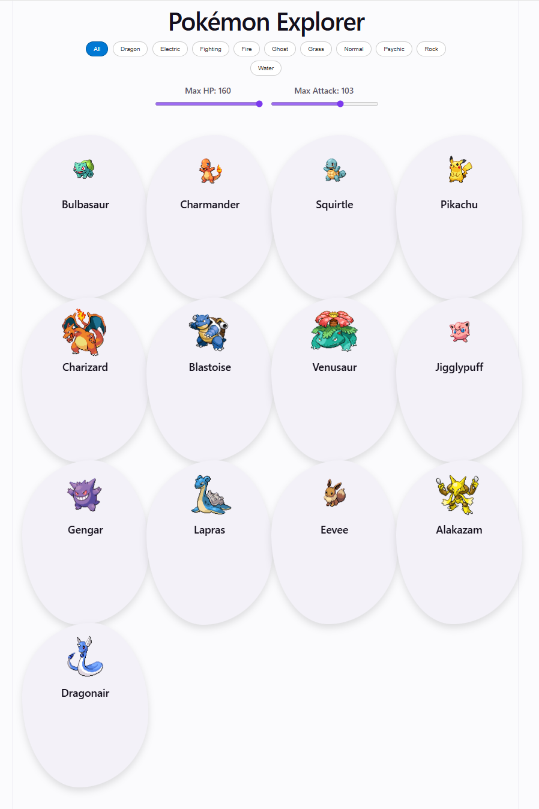

# Pokémon Explorer

A React Foundation learning exercise built before the D3 Loves React course introduced D3 visualization complexity. This culminating project for the course's second module uses a course-supplied 20-Pokémon dataset to practice components, props, state, list rendering, filtering, and conditional UI.

## Live demo

[Explore the Pokémon card collection](https://unguisdraconis.github.io/pokemon-explorer/)



## Assignment context

The React Foundation assignment asked learners to build a small project from scratch with Vite and npm, render a grid of Pokémon cards, add simple interactions, and deploy the result. The implementation stays close to that learning scope while adding stat filters and interactive flip cards.

## Data

The 20-object Pokémon array was supplied directly by the D3 Loves React course and is preserved unchanged. Each object contains an `id`, `name`, `type`, `hp`, and `attack` value. The values have not been independently researched or validated for this project.

## Sprites

The course prescribed static sprite URLs from the [PokeAPI sprites repository](https://github.com/PokeAPI/sprites), constructed from each Pokémon ID. The application loads those image files remotely; it does not query the live PokeAPI data API.

## React concepts practiced

- A simple two-component structure: `App` and `PokemonCard`
- Props and `.map()` list rendering with stable IDs
- `useState` for collection filters and independent card state
- Derived filtering and conditional UI classes
- Click and keyboard event handling
- `useEffect`, `useRef`, and timer cleanup
- Responsive CSS grid layout and light/dark color schemes

## Implemented interactions

- Filter the collection by Pokémon type
- Set maximum HP and Attack values
- Flip individual cards with a click, Enter, or Space
- Keep flip state independent for each mounted card
- Return flipped cards to their front face after 10 seconds

Favorites were one possible assignment suggestion, but this implementation instead focuses on stat filtering and card flipping.

## Learning progression

This repository preserves the React Foundation stage of the course: components, props, state, lists, and conditional UI leading into later React-managed D3 visualization work.

## Historical limitations

The course-supplied data remains inline, and the application intentionally retains its two-component learning-stage structure. It has no persistence, routing, live API data fetching, external state library, automated test suite, or continuous-integration workflow.

## Accessibility

The preserved card interaction supports click, Enter, and Space input. Flip state and selected type state are exposed programmatically, inactive card faces are hidden from assistive technology, keyboard focus remains visible, and empty filter combinations produce a visible status message.

## AI assistance

AI assistance was used for project scaffolding.

## Local use

```bash
npm ci
npm run dev
```

Additional checks are available with `npm run lint` and `npm run build`.
